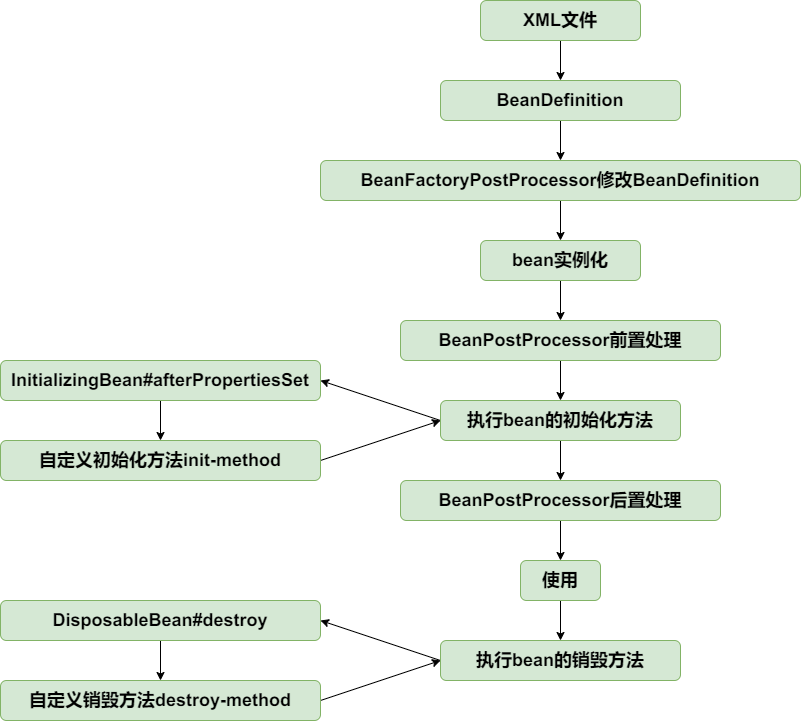

# Spring简易版实现 开发手册
### 实现BeanDefinition 和 BeanDefinitionRegistry

首先，我们可以创建一个最简单的容器——BeanFactory。这个BeanFactory中定义了一个Map，我们可以根据Bean的名字，取出Bean对象。
```java
    public class BeanFactory {
    private Map<String, Object> beanMap = new HashMap<>();
    public void registerBean(String name, Object bean) {
        beanMap.put(name, bean);
    }
    public Object getBean(String name) {
        return beanMap.get(name);
    }
}
```
但是这样的话，不易于我们进行扩展，在spring中，早期的时候，
我们会通过写xml配置文件的方式去定义一些Bean的信息 ，
而这些Bean的信息，
我们会将其存放在一个叫BeanDefinition的类中，
因此我们会创建一个BeanDefinition类存放Bean的信息,
这个类中目前存储了Bean的Class类别，
并且提供了get和set方法，
```java
public class BeanDefinition {
    private Class beanClass;
    public BeanDefinition(Class beanClass) {
        this.beanClass = beanClass;
    }
    public Class getBeanClass() {
        return beanClass;
    }
    public void setBeanClass(Class beanClass) {
        this.beanClass = beanClass;
    }
}
```
另外，这些BeanDefinition的对象，
也就是每个Bean的信息我们也会将他保存到一个容器中，
因此我们创建一个接口BeanDefinitionRegistry,用于注册Bean的信息
```java
public interface BeanDefinitionRegistry {
    // 向注册表中加入BeanDefinition
    void registerBeanDefinitionRegistry(String name, BeanDefinition beanDefinition);
}
```

为了扩展性，我们将BeanFactory设置成一个接口，
这个接口提供一个方法：getBean
```java
public interface BeanFactory {
    Object getBean(String name);
}
```
在BeanFactory我们提供一个方法可以获得Bean，这个Bean既可以获得单例,
，也可以夺得prototype类型的Bean,因此我们还需要一个接口，
可以通过这个接口去得到单例Bean，
所以我们定义接口SingletonBeanRegistry，这个接口中提供一个方法，
获取单例的Bean，之后我们BeanFactory想要获取单例的Bean，
我们就可以用这个接口的方法，
```java
public interface SingletonBeanRegistry {
    Object getSingleton(String beanName);
}
```
创建了这个接口后，我们给它一个实现类吧，我们把这个实现类叫做DefaultSingletonBeanRegistry，
我们添加一个新功能，就是让我们的Bean注册器，可以往IOC容器中新加入一个Bean，
，并且我们将Map对象定义在这里。
```java
public class DefaultSingletonBeanRegistry implements SingletonBeanRegistry {

    Map<String,Object> singletonObjects = new HashMap<>();

    @Override
    public Object getSingleton(String beanName) {
        return singletonObjects.get(beanName);
    }

    protected void addSingleton(String beanName,Object singletonObject) {
        singletonObjects.put(beanName,singletonObject);
    }

}
```
然后我们定义一个抽象类，这个抽象类AbstractBeanFactory继承自DefaultSingletonBeanRegistry，
并且实现了BeanFactory接口，因此它具有前面两者的功能，
并且我们在这里实现BeanFactory接口的方法，我们还在这个类中提供两个抽象方法，
一个是更加方便的创建Bean的方法createBean，还有一个是根据Bean的名字
去获取Bean的信息的方法。
```java
public abstract class AbstractBeanFactory extends DefaultSingletonBeanRegistry implements BeanFactory {
    @Override
    public Object getBean(String name) throws BeansException {
        Object bean = getSingleton(name);
        if(bean != null) { // 如果容器中已经存在,直接返回bean
            return bean;
        }
        // 容器中不存在,创建Bean
        BeanDefinition beanDefinition = getBeanDefinition(name);
        return createBean(name,beanDefinition);
    }
    protected abstract Object createBean(String beanName,BeanDefinition beanDefinition) throws BeansException;
    protected abstract BeanDefinition getBeanDefinition(String beanName) throws BeansException;
}
```
好的，接下来我们继续往下扩展功能，我们在spring项目中，定义了Bean之后，
根据Bean定义的信息，我们是可以往这个Bean中自动注入属性的，因此我们创建一个抽象类AbstractAutowireCapableBeanFactory
，这个抽象类继承自我们刚刚创建的AbstractBeanFactory，并且实现了createBean方法，这个方法中我们调用doCreateBean方法。
之后为bean注入属性的过程，我们会写在doCreateBean中，目前只是先简单创建一下对象
```java
public abstract class AbstractAutowireCapableBeanFactory extends AbstractBeanFactory{
    @Override
    protected Object createBean(String beanName, BeanDefinition beanDefinition) throws BeansException {
        return doCreateBean(beanName,beanDefinition);
    }
    protected Object doCreateBean(String beanName,BeanDefinition beanDefinition) {
        Class beanClass = beanDefinition.getBeanClass();
        Object bean = null;
        try {
            bean = beanClass.newInstance();
        } catch (Exception e) {
            throw new BeansException("Instantiation of bean failed",e);
        }
        addSingleton(beanName,bean); // 加入容器中
        return bean;
    }
}
```
好的，完成了以上工作之后，我们要来实现spring中十分重要的一个类：
DefaultListableBeanFactory，这个类继承自AbstractAutowireCapableBeanFactory
，并且它实现了BeanDefinitionRegistry，在这个类中，我们会创建一个Map，
这个Map存放每个Bean对应的Bean信息，也就是BeanDefinition。
然后实现了根据Bean名称获取Bean定义信息的方法，并且我们可以将Bean的信息，放入到Map容器中。
```java
public class DefaultListableBeanFactory extends AbstractAutowireCapableBeanFactory implements BeanDefinitionRegistry{
    private Map<String,BeanDefinition> beanDefinitionMap = new HashMap<>();
    @Override
    protected BeanDefinition getBeanDefinition(String beanName) throws BeansException {
        BeanDefinition beanDefinition = beanDefinitionMap.get(beanName);
        if(beanDefinition == null) {
            throw new BeansException("No bean named '" + beanName + "' is defined");
        }
        return beanDefinition;
    }

    @Override
    public void registerBeanDefinitionRegistry(String name, BeanDefinition beanDefinition) {
        beanDefinitionMap.put(name, beanDefinition);
    }
}
```

好的，接下来，我们来测试一下十分能够正常运行，我们可以编写以下测试代码
```java
 public class BeanFactoryTest {
    @Test
    public void testBeanFactory() throws Exception {
        DefaultListableBeanFactory beanFactory = new DefaultListableBeanFactory();
        BeanDefinition beanDefinition = new BeanDefinition(HelloService.class);
        beanFactory.registerBeanDefinitionRegistry("helloService",beanDefinition);
        HelloService helloService = (HelloService) beanFactory.getBean("helloService");
        helloService.sayHello();
    }
}
```
首先第一步，我们创建一个DefaultListableBeanFactory, 接着我们开始定义Bean信息，
我们创建一个BeanDefinition，传入一个HelloService的Class，
DefaultListableBeanFactory实现了BeanDefinitionRegistry接口，
因此我们可以在此处注册BeanDefinition，接着调用getBean方法，尝试获取Bean实例，
调用getBean之后，我们会走到AbstractBeanFactory类中的getBean方法，这个类继承自DefaultSingletonBeanRegistry，因此我们会调用DefaultSingletonBeanRegistry的getSingleton方法，可惜容器中此时还没有这个对象，
因此我们会创建这个对象，首先根据bean的名称获取BeanDefinition，
然后调用createBean方法，此时会调用了AbstractAutowireCapableBeanFactory中实现的doCreateBean方法，
在这个方法中获取Bean的Class，然后通过反射实例化Bean，接着调用 addSingleton，将它添加到容器中，
并且将实例化后的bean返回。最后一步步返回给了测试方法中的getBean的返回值。
然后我们就可以正常使用这个bean了。

### 定义Bean的实例化策略
目前我们实现了创建一个不含有属性的Bean，接着来定义一下Bean的实例化策略，
首先，依然是创建一个接口，在这个接口中我们定义一个实例化bean的方法，我们可以创建不同的实现类，
来定义不同的实例化策略。
```java
public interface InstantiationStrategy {
    Object instantiate(BeanDefinition beanDefinition) throws BeansException;
}
```
我们来简单的创建两个实现类吧，首先创建一个最简单的实例化策略，也就是根据类的类型，直接反射实例化
```java
public class SimpleInstantiationStrategy implements InstantiationStrategy{
    // 简单的bean实例化策略，根据bean的无参构造函数实例化对象
    @Override
    public Object instantiate(BeanDefinition beanDefinition) throws BeansException {
        Class beanClass = beanDefinition.getBeanClass();
        try {
            Constructor constructor = beanClass.getDeclaredConstructor();
            return constructor.newInstance();

        } catch (Exception e) {
        }
        return null;
    }
}
```
我们也可以通过CGLIB动态创建子类
```java
public class CglibSubclassingInstantiationStrategy implements InstantiationStrategy{
    @Override
    public Object instantiate(BeanDefinition beanDefinition) throws BeansException {
        Enhancer enhancer = new Enhancer();
        enhancer.setSuperclass(beanDefinition.getBeanClass());
        enhancer.setCallback((MethodInterceptor) (obj, method, argsTemp, proxy) -> proxy.invokeSuper(obj,argsTemp));
        return enhancer.create();
    }
}
```

我们来修改一下AbstractAutowireCapableBeanFactory类，我们添加一个InstantiationStrategy类型成员变量，并且将他默认实例化为SimpleInstantiationStrategy的对象。
然后在doCreateBean方法中不直接通过类名放射调用，而是直接调用实例化策略类的实例化方法。
具体代码如下：
```java
public abstract class AbstractAutowireCapableBeanFactory extends AbstractBeanFactory{

    private InstantiationStrategy instantiationStrategy = new SimpleInstantiationStrategy();
    @Override
    protected Object createBean(String beanName, BeanDefinition beanDefinition) throws BeansException {
        return doCreateBean(beanName,beanDefinition);
    }
    protected Object doCreateBean(String beanName,BeanDefinition beanDefinition) {
        // Class beanClass = beanDefinition.getBeanClass();
        Object bean = null;
        try {
            bean = createBeanInstance(beanDefinition);
        } catch (Exception e) {
            throw new BeansException("Instantiation of bean failed",e);
        }
        addSingleton(beanName,bean); // 加入容器中
        return bean;
    }

    protected Object createBeanInstance(BeanDefinition beanDefinition) {
        return instantiationStrategy.instantiate(beanDefinition);
    }

    public void setInstantiationStrategy(InstantiationStrategy instantiationStrategy) {
        this.instantiationStrategy = instantiationStrategy;
    }

    public InstantiationStrategy getInstantiationStrategy() {
        return instantiationStrategy;
    }
}
```

### 给Bean注入属性

我们在xml文件中写spring配置文件时候，定义了一个有属性的bean之后，我们还要在bean标签下定义property标签，里面描述了这个bean中各个属性的值，因此这些值我们也要记录下来，我们定义一个类表示单个property的信息，
其中包括属性名和属性的值，该类的全部信息如下：
```java
public class PropertyValue {
    private final String name;
    private final String value;
    public PropertyValue(String name, String value) {
        this.name = name;
        this.value = value;
    }
    public String getName() {
        return name;
    }
    public String getValue() {
        return value;
    }
}
```
每个bean会有若干属性，因此我们还要定义一个类，用数组保存某个bean的全部属性：
```java
public class PropertyValues {
    private final List<PropertyValue> propertyValueList = new ArrayList<>();
    public void addPropertyValue(PropertyValue propertyValue) {
        propertyValueList.add(propertyValue);
    }
    public PropertyValue[] getPropertyValues() {
        return this.propertyValueList.toArray(new PropertyValue[0]);
    }
    public PropertyValue getPropertyValue(String propertyName) {
        for(var propertyValue : propertyValueList) {
            if(propertyValue.getName().equals(propertyName)) {
                return propertyValue;
            }
        }
        return null;
    }
}
```
接着我们去修改BeanDefinition，在这里面我们既要保存bean的class类型，还要保存这个bean的所有属性的信息，
因此我们要添加一个PropertyValues类型的成员变量，修改如下：
```java
public class BeanDefinition {
    private Class beanClass;
    private PropertyValues propertyValues;
    public BeanDefinition(Class beanClass) {
        this(beanClass,null);
    }
    public BeanDefinition(Class beanClass, PropertyValues propertyValues) {
        this.beanClass = beanClass;
        this.propertyValues = propertyValues != null ? propertyValues : new PropertyValues();
    }
    public Class getBeanClass() {
        return beanClass;
    }
    public void setBeanClass(Class beanClass) {
        this.beanClass = beanClass;
    }

    public PropertyValues getPropertyValues() {
        return propertyValues;
    }

    public void setPropertyValues(PropertyValues propertyValues) {
        this.propertyValues = propertyValues;
    }
}
```
添加该信息后，在AbstractAutowireCapableBeanFactory类中，我们要在创建bean的时候为其注入属性，首先选择给定的实例化策略实例化bean，
接着再添加一个方法为其注入属性，该方法接收三个参数：beanName、bean实例以及bean的相关信息。
在这个方法中，我们首先获取bean的class类型，以便后续通过反射调用其set方法，接着我们遍历bean信息中的属性信息
，获取属性名和值，通过反射获取属性名对应的属性类型，使用拼接字符串的方式获取set方法名，反射获取该set方法，
最后反射调用该方法，为bean实例注入属性。
```java
public abstract class AbstractAutowireCapableBeanFactory extends AbstractBeanFactory{
    protected Object doCreateBean(String beanName,BeanDefinition beanDefinition) {
        Object bean = null;
        try {
            // 实例化bean
            bean = createBeanInstance(beanDefinition);
            // 为bean注入属性
            applyPropertyValues(beanName, bean, beanDefinition);
        } catch (Exception e) {
            throw new BeansException("Instantiation of bean failed",e);
        }
        addSingleton(beanName,bean); // 加入容器中
        return bean;
    }
    // 为bean注入属性
    protected void applyPropertyValues(String beanName,Object bean,BeanDefinition beanDefinition) {
        try {
            Class beanClass = beanDefinition.getBeanClass();
            for(PropertyValue propertyValue : beanDefinition.getPropertyValues().getPropertyValues()) {
                String name = propertyValue.getName();
                String value = propertyValue.getValue();
                Class<?> type = beanClass.getDeclaredField(name).getType();
                String methodName = "set" + name.substring(0,1).toUpperCase() + name.substring(1); // 获取set方法名
                Method method = beanClass.getDeclaredMethod(methodName, new Class[]{type});
                method.invoke(bean,new Object[]{value});
            }
        } catch (Exception e) {
            throw new BeansException("Error setting property values for bean: " + beanName, e);
        }
    }
}
```
### 为bean注入其他bean
上一步已经完成了为bean注入基本属性，但是如果一个bean的属性是其他bean呢？上面的方法就没法完成了，
因此我们再定义一个BeanReference类，这个类表示一种特殊的属性值，因此我们要修改之前创建的PropertyValue类，
将其成员变量value的类型改为Object，我们还可以利用hutool工具类更简单的完成为bean注入属性这件事情，
BeanReference类如下：
```java
public class BeanReference {
    private final String beanName;
    public BeanReference(String beanName) {
        this.beanName = beanName;
    }
    public String getBeanName() {
        return beanName;
    }
}
```
接着我们会在注入属性的方法中判断，当前遍历到的属性是不是BeanReference类型，如果是的话，
我们会根据BeanReference中获取beanName，然后获取bean，接着将value设置为bean，以完成属性的注入，
此时applyPropertyValues的for循环中的代码如下：
```java
for(PropertyValue propertyValue : beanDefinition.getPropertyValues().getPropertyValues()) {
        String name = propertyValue.getName();
        Object value = propertyValue.getValue();
        if(value instanceof BeanReference) {
            // 如果注入的属性是一个Bean，则获取这个bean
            BeanReference beanReference = (BeanReference) value;
            value = getBean(beanReference.getBeanName());
        }
        BeanUtil.setFieldValue(bean,name,value);
}
```

此时bean的属性注入已经完成，编写测试代码,通过测试。
```java
public class PopulateBeanWithPropertyValuesTest {
    @Test
    public void testPopulateBeanWithPropertyValues() throws Exception {
        DefaultListableBeanFactory beanFactory = new DefaultListableBeanFactory();
        PropertyValues propertyValues = new PropertyValues();
        propertyValues.addPropertyValue(new PropertyValue("name","ljx"));
        propertyValues.addPropertyValue(new PropertyValue("age",21));
        BeanDefinition beanDefinition = new BeanDefinition(Person.class,propertyValues);
        beanFactory.registerBeanDefinitionRegistry("person",beanDefinition);
        Person person = (Person) beanFactory.getBean("person");
        System.out.println(person);
    }
    @Test
    public void testPopulateBeanWithBean() throws Exception {
        DefaultListableBeanFactory beanFactory = new DefaultListableBeanFactory();
        // 注册Car示例
        PropertyValues propertyValues = new PropertyValues();
        propertyValues.addPropertyValue(new PropertyValue("brand","byd"));
        BeanDefinition beanDefinition = new BeanDefinition(Car.class,propertyValues);
        beanFactory.registerBeanDefinitionRegistry("car",beanDefinition);
        // 注册Person对象，Person对象中组合了Car对象
        propertyValues = new PropertyValues();
        propertyValues.addPropertyValue(new PropertyValue("name","ljx"));
        propertyValues.addPropertyValue(new PropertyValue("age",21));
        propertyValues.addPropertyValue(new PropertyValue("car",new BeanReference("car")));
        BeanDefinition personBeanDefinition = new BeanDefinition(Person.class,propertyValues);
        beanFactory.registerBeanDefinitionRegistry("person",personBeanDefinition);
        System.out.println(beanFactory.getBean("car"));
        System.out.println(beanFactory.getBean("person"));

    }
}
```
### 实现资源类和资源加载器
创建接口Resource,这是资源的抽象和访问的接口，我们可以有不同的实现类。
```java
public interface Resource {
    InputStream getInputStream() throws IOException;
}
```
接着我们可以创建三个Resource接口的实现类，分别是对java.net.URL进行资源定位的实现类、
对文件系统资源定位的实现类以及对类路径下资源定位的实现类。
```java
public class UrlResource implements Resource{
    private final URL url;
    public UrlResource(URL url) {
        this.url = url;
    }
    @Override
    public InputStream getInputStream() throws IOException {
        URLConnection con = this.url.openConnection();
        try {
            return con.getInputStream();
        } catch (IOException e) {
            throw e;
        }
    }
}
```
```java
public class FileSystemResource implements Resource{
    private final String filePath;
    public FileSystemResource(String filePath) {
        this.filePath = filePath;
    }
    @Override
    public InputStream getInputStream() throws IOException {
        try {
            Path path = new File(this.filePath).toPath();
            return Files.newInputStream(path);
        } catch (NoSuchFileException e) {
            throw new FileNotFoundException(e.getMessage());
        }
    }
}
```
```java
public class ClassPathResource implements Resource{
    private final String path;
    public ClassPathResource(String path) {
        this.path = path;
    }
    @Override
    public InputStream getInputStream() throws IOException {
        InputStream is = this.getClass().getClassLoader().getResourceAsStream(this.path);
        if(is == null) {
            throw new FileNotFoundException(this.path + " 不存在,打开失败");
        }
        return is;
    }
    public String getPath() {
        return path;
    }
}
```
为了加载这些资源，我们首先创建一个资源加载器接口，接口提供一个获取资源的方法，资源加载器可以有不同的实现类。
```java
public interface ResourceLoader {
    Resource getResource(String location);
}
```
创建一个默认的资源加载器的实现类，如果location以"classpath:"开头，那么加载classpath资源，否则当成url资源处理，如果处理发生异常，捕获该异常，当成系统文件资源处理即可。
```java
public class DefaultResourceLoader implements ResourceLoader{
    public static final String CLASSPATH_URL_PREFIX = "classpath:";
    @Override
    public Resource getResource(String location) {
        if(location.startsWith(CLASSPATH_URL_PREFIX)) {
            // classpath下的资源
            return new ClassPathResource(location.substring(CLASSPATH_URL_PREFIX.length()));
        } else {
            try {
                // 当成UrlResource处理
                URL url = new URL(location);
                return new UrlResource(url);
            } catch (MalformedURLException e) {
                // 当成文件系统下的资源来处理
                String path = location;
                if(location.startsWith("/")) {
                    path = location.substring(1);
                }
                return new FileSystemResource(path);
            }
        }
    }
}
```
编写测试类,测试资源加载是否成功:
```java
public class ResourceLoaderTest {
    @Test
    public void testResourceLoader() throws Exception {
        DefaultResourceLoader defaultResourceLoader = new DefaultResourceLoader();

        // 测试类路径下的加载
        Resource resource = defaultResourceLoader.getResource("classpath:ljx.txt");
        InputStream inputStream = resource.getInputStream();
        String s = IoUtil.readUtf8(inputStream);
        System.out.println(s);

        // 加载文件系统中的资源
        resource = defaultResourceLoader.getResource("D:\\code\\java-workplace\\spring-mini\\src\\test\\resources\\xxx.txt");
        inputStream = resource.getInputStream();
        s = IoUtil.readUtf8(inputStream);
        System.out.println(s);

        // 加载Url资源
        resource = defaultResourceLoader.getResource("https://www.baidu.com");
        if(resource instanceof UrlResource) {
            System.out.println("是网络资源");
            inputStream = resource.getInputStream();
            s = IoUtil.readUtf8(inputStream);
            System.out.println(s);
        } else {
            System.out.println("加载Url资源有问题");
        }

    }
}
```

### 读取xml文件来配置bean
有了资源加载器，就可以在xml格式配置文件中声明式地定义bean的信息，
资源加载器读取xml文件，解析出bean的信息，自动往容器中注册BeanDefinition。

BeanDefinitionReader是读取bean定义信息的抽象接口，
XmlBeanDefinitionReader是从xml文件中读取的实现类。
BeanDefinitionReader需要有获取资源的能力，
且读取bean定义信息后需要往容器中注册BeanDefinition
，因此BeanDefinitionReader的抽象实现类AbstractBeanDefinitionReader拥有ResourceLoader和BeanDefinitionRegistry两个属性。

首先创建BeanDefinitionReader接口:
```java
public interface BeanDefinitionReader {
    BeanDefinitionRegistry getRegistry();

    ResourceLoader getResourceLoader();

    void loadBeanDefinitions(Resource resource) throws BeansException;

    void loadBeanDefinitions(String location) throws BeansException;

    void loadBeanDefinitions(String[] locations) throws  BeansException;
}
```
因为我们可能不只是需要从xml配置文件中读取bean信息，所以我们定义一个抽象类AbstractBeanDefinitionReader实现该接口，
该类中有资源加载器和Bean信息的注册器两个成员变量。
我们在这个抽象类中未实现这两个方法：因为这两个方法的实现和我们从哪里读取信息相关，我们不能放在抽象类中实现。
```
loadBeanDefinitions(Resource resource);
loadBeanDefinitions(String location);
```
AbstractBeanDefinitionReader内容如下：
```java
public abstract class AbstractBeanDefinitionReader implements BeanDefinitionReader{
    private final BeanDefinitionRegistry registry;
    private ResourceLoader resourceLoader;
    protected AbstractBeanDefinitionReader(BeanDefinitionRegistry registry) {
        this.registry = registry;
        this.resourceLoader = new DefaultResourceLoader();
    }
    @Override
    public BeanDefinitionRegistry getRegistry() {
        return registry;
    }
    @Override
    public void loadBeanDefinitions(String[] locations) throws BeansException {
        for(var location : locations) {
            loadBeanDefinitions(location);
        }
    }
    public void setResourceLoader(ResourceLoader resourceLoader) {
        this.resourceLoader = resourceLoader;
    }
    @Override
    public ResourceLoader getResourceLoader() {
        return resourceLoader;
    }
}
```
接着创建具体的实现类XlmFileBeanDefinitionReader,该类继承自上述抽象类。首先，我们要定义标签的常量，例如bean标签，和property标签。
还要定义属性的常量：比如id、name、class、value等等。接着从资源中获取InputStream，最后解析xml文档，将bean信息定义好后使用bean信息注册器注册bean信息。
该类的内容如下：
```java
public class XmlFileBeanDefinitionReader extends AbstractBeanDefinitionReader {

    public static final String BEAN_ELEMENT = "bean";
    public static final String PROPERTY_ELEMENT = "property";
    public static final String ID_ATTRIBUTE = "id";
    public static final String NAME_ATTRIBUTE = "name";
    public static final String CLASS_ATTRIBUTE = "class";
    public static final String VALUE_ATTRIBUTE = "value";
    public static final String REF_ATTRIBUTE = "ref";

    public XmlFileBeanDefinitionReader(BeanDefinitionRegistry registry) {
        super(registry);
    }

    @Override
    public void loadBeanDefinitions(Resource resource) throws BeansException {
        try {
            InputStream inputStream = resource.getInputStream();
            try {
                doLoadBeanDefinitions(inputStream);
            } finally {
                inputStream.close();
            }
        } catch (Exception e) {
            throw new BeansException("IOException 解析xml文档失败:" + resource, e);
        }
    }

    /**
     * @param inputStream
     * @throws Exception
     * 做具体xml文档解析
     */
    protected void doLoadBeanDefinitions(InputStream inputStream) throws Exception{
        Document document = XmlUtil.readXML(inputStream);

        Element root = document.getDocumentElement(); //

        NodeList childNodes = root.getChildNodes();

        for(int i = 0;i < childNodes.getLength();++i) {
            if(childNodes.item(i) instanceof Element) {
                // 子结点如果是一个标签
                if(BEAN_ELEMENT.equals(((Element) childNodes.item(i)).getNodeName())) {
                    // 子标签为bean，解析
                    Element bean = (Element) childNodes.item(i);
                    // 获取id、name、class属性
                    String id = bean.getAttribute(ID_ATTRIBUTE);
                    String name = bean.getAttribute(NAME_ATTRIBUTE);
                    String className = bean.getAttribute(CLASS_ATTRIBUTE);

                    Class<?> clazz = Class.forName(className);

                    // id属性的优先级高于name属性
                    String beanName = StrUtil.isNotEmpty(id) ? id : name;

                    if (StrUtil.isEmpty(beanName)) {
                        //如果id和name都为空，将类名的第一个字母转为小写后作为bean的名称
                        beanName = StrUtil.lowerFirst(clazz.getSimpleName());
                    }

                    BeanDefinition beanDefinition = new BeanDefinition(clazz);

                    // 注入属性
                    for(int j = 0;j < bean.getChildNodes().getLength();++j) {
                        if (bean.getChildNodes().item(j) instanceof Element) {
                            if(PROPERTY_ELEMENT.equals(((Element)bean.getChildNodes().item(j)).getNodeName())) {
                                // 解析property标签
                                Element property = (Element) bean.getChildNodes().item(j);
                                String nameAttribute = property.getAttribute(NAME_ATTRIBUTE);
                                String valueAttribute = property.getAttribute(VALUE_ATTRIBUTE);
                                String refAttribute = property.getAttribute(REF_ATTRIBUTE);

                                Object value = valueAttribute;

                                if(StrUtil.isNotEmpty(refAttribute)) {
                                    value = new BeanReference(refAttribute);
                                }
                                PropertyValue propertyValue = new PropertyValue(nameAttribute,value);
                                beanDefinition.getPropertyValues().addPropertyValue(propertyValue);
                            }
                        }
                    }
                    getRegistry().registerBeanDefinitionRegistry(beanName,beanDefinition);
                }
            }
        }

    }

    @Override
    public void loadBeanDefinitions(String location) throws BeansException {
        ResourceLoader resourceLoader = getResourceLoader();
        Resource resource = resourceLoader.getResource(location);
        loadBeanDefinitions(resource);
    }
}
```

编写测试代码测试，测试的spring配置文件如下：
```xml
<?xml version="1.0" encoding="UTF-8"?>
<beans>
    <bean id="person" class="com.ljx.springframework.test.ioc.bean.Person">
        <property name="name" value="ljx"/>
        <property name="age" value="18"/>
        <property name="car" ref="car"/>
    </bean>
    <bean id="car" class="com.ljx.springframework.test.ioc.bean.Car">
        <property name="brand" value="byd"/>
    </bean>
</beans>
```
测试代码如下：
```java
public class XmlFileDefineBeanTest {
    @Test
    public void testXmlFileParse() throws Exception {
        DefaultListableBeanFactory beanFactory = new DefaultListableBeanFactory();
        XmlFileBeanDefinitionReader xmlFileBeanDefinitionReader = new XmlFileBeanDefinitionReader(beanFactory);
        ResourceLoader resourceLoader = new DefaultResourceLoader();
        Resource resource = resourceLoader.getResource("classpath:spring.xml");
        xmlFileBeanDefinitionReader.loadBeanDefinitions(resource);

        Person person = (Person) beanFactory.getBean("person");
        System.out.println(person);
        Car car = (Car) beanFactory.getBean("car");
        System.out.println(car);
    }
}
```

### spring后处理器的实现

spring中有两种后处理器，分别是BeanFactoryPostProcessor和BeanPostProcessor。

BeanFactoryPostProcessor是一种spring为我们提供的容器扩展机制，允许我们在bean实例化之前修改bean的定义信息，它在BeanDefinitionMap填充完毕之后，Bean实例化之前执行。

BeanPostProcessor是另一种容器扩展机制，但是不同于BeanFactoryPostProcessor的是：BeanPostProcessor在bean实例化后修改bean或替换bean。BeanPostProcessor是后续实现AOP的关键。

首先定义一下接口BeanFactoryPostProcessor，该接口仅有一个方法：postProcessBeanFactory
它接收BeanFactory作为参数，该方法在所有BeanDefinition加载完成后，但在bean实例化之前，提供修改BeanDefinition属性值的机制。
```java
public interface BeanFactoryPostProcessor {
    void postProcessBeanFactory(ConfigurableListableBeanFactory beanFactory) throws BeansException;
}
```
定义BeanPostProcessor接口：
```java
public interface BeanPostProcessor {
    Object postProcessBeforeInitialization(Object bean,String beanName) throws BeansException;
    Object postProcessAfterInitialization(Object bean,String beanName) throws BeansException;
}
```

定义一个可自行配置的BeanFactory:
```java
public interface ConfigurableBeanFactory extends BeanFactory,SingletonBeanRegistry {
    void addBeanPostProcessor(BeanPostProcessor beanPostProcessor);
}
```
该接口继承自BeanFactory和SingletonBeanRegistry，因此它具有二者的功能。
addBeanPostProcessor可以为bean添加后处理器。

定义接口AutowireCapableBeanFactory，该接口提供执行BeanPostProcessor的postProcessBeforeInitialization方法和postProcessAfterInitialization方法。
```java
public interface AutowireCapableBeanFactory extends BeanFactory {
    /**
     * 执行BeanPostProcessors的postProcessBeforeInitialization方法
     */
    Object applyBeanPostProcessorsBeforeInitialization(Object existingBean, String beanName) throws BeansException;
    /**
     * 执行BeanPostProcessors的postProcessAfterInitialization方法
     */
    Object applyBeanPostProcessorsAfterInitialization(Object existingBean, String beanName) throws BeansException;
}
```

我们在AbstractAutowireCapableBeanFactory类中创建bean的时候需要调用bean后处理器的方法，因此我们需要保存所有定义的bean后处理器，我们把它放在AbstractBeanFactory中，
添加成员变量以及添加bean后处理器的方法和获得后处理器的get方法：
```java
private final List<BeanPostProcessor> beanPostProcessorList = new ArrayList<>();
@Override
public void addBeanPostProcessor(BeanPostProcessor beanPostProcessor) {
        this.beanPostProcessorList.remove(beanPostProcessor);
        this.beanPostProcessorList.add(beanPostProcessor);
        }

public List<BeanPostProcessor> getBeanPostProcessorList() {
        return beanPostProcessorList;
        }
```

修改一下AbstractAutowireCapableBeanFactory类，让它实现AutowireCapableBeanFactory接口，
在这个类中，我们会创建bean，因此在此调用后处理器的方法。

修改doCreateBean方法：
```
    protected Object doCreateBean(String beanName,BeanDefinition beanDefinition) {
        Object bean = null;
        try {
            // 实例化bean
            bean = createBeanInstance(beanDefinition);
            // 为bean注入属性
            applyPropertyValues(beanName, bean, beanDefinition);
            //执行bean的初始化方法和BeanPostProcessor的前置和后置处理方法
            bean = initializeBean(beanName,bean,beanDefinition);
        } catch (Exception e) {
            throw new BeansException("Instantiation of bean failed",e);
        }
        addSingleton(beanName,bean); // 加入容器中
        return bean;
    }
```

可以看到，我们为bean注入属性之后，调用一个initializeBean方法，在这个方法中，我们会执行bean的初始化方法以及后处理器的前置处理和后置处理方法。
```
    protected Object initializeBean(String beanName, Object bean, BeanDefinition beanDefinition) {
        // 执行前置处理器
        Object wrappedBean = applyBeanPostProcessorsBeforeInitialization(bean, beanName);
        //TODO 后面会在此处执行bean的初始化方法
        invokeInitMethods(beanName, wrappedBean, beanDefinition);

        //执行BeanPostProcessor的后置处理
        wrappedBean = applyBeanPostProcessorsAfterInitialization(bean, beanName);
        return wrappedBean;
    }
```

在该类中实现applyBeanPostProcessorsBeforeInitialization方法和applyBeanPostProcessorsAfterInitialization方法，这两个方法很简单，就是调用一下定义的bean后处理器方法
```
    @Override
    public Object applyBeanPostProcessorsBeforeInitialization(Object existingBean, String beanName) throws BeansException {
        Object res = existingBean;
        for(var processor : getBeanPostProcessorList()) {
            Object current = processor.postProcessBeforeInitialization(res,beanName);
            if(current == null) {
                return res;
            }
            res = current;
        }
        return res;
    }
    @Override
    public Object applyBeanPostProcessorsAfterInitialization(Object existingBean, String beanName) throws BeansException {
        Object res = existingBean;
        for(var processor : getBeanPostProcessorList()) {
            Object current = processor.postProcessAfterInitialization(res,beanName);
            if(current == null) {
                return res;
            }
            res = current;
        }
        return res;
    }
```
BeanPostProcessor的实现完成后，再去完善一下BeanFactoryPostProcessor实现，这涉及到bean的属性的修改，
因为BeanFactoryPostProcessor是在bean的信息（BeanDefinition）保存到map之前完成的，所以我们需要拿到对应的bean的定义信息，
从而修改它（增加属性、删除属性、修改属性）。其中对于修改的操作，我们要直接修改原属性，因此添加属性的时候需要遍历修改一下，也就是在
PropertyValues类中的addPropertyValue中先循环遍历判断一下，最后再添加：
```java
public class PropertyValues {
    private final List<PropertyValue> propertyValueList = new ArrayList<>();
    public void addPropertyValue(PropertyValue propertyValue) {
        for (int i = 0; i < this.propertyValueList.size(); i++) {
            PropertyValue currentPv = this.propertyValueList.get(i);
            if (currentPv.getName().equals(propertyValue.getName())) {
                //覆盖原有的属性值
                this.propertyValueList.set(i, propertyValue);
                return;
            }
        }
        this.propertyValueList.add(propertyValue);
    }
}
```

再来测试一下上述代码，也就是演示一下两种后处理器的使用过程：

首先创建spring配置文件：
```xml
<?xml version="1.0" encoding="UTF-8"?>
<beans>
    <bean id="person" class="com.ljx.springframework.test.ioc.bean.Person">
        <property name="name" value="ljx"/>
        <property name="age" value="21"/>
        <property name="car" ref="car"/>
    </bean>
    <bean id="car" class="com.ljx.springframework.test.ioc.bean.Car">
        <property name="brand" value="byd"/>
    </bean>
</beans>
```
接着我们来创建一个BeanFactoryPostProcessor的实现类，在bean创建之前，修改它的定义信息：
```java
public class CustomBeanFactoryPostProcessor implements BeanFactoryPostProcessor {
    @Override
    public void postProcessBeanFactory(ConfigurableListableBeanFactory beanFactory) throws BeansException {
        System.out.println("CustomBeanFactoryPostProcessor#postProcessBeanFactory");
        BeanDefinition beanDefinition = beanFactory.getBeanDefinition("person");
        PropertyValues propertyValues = beanDefinition.getPropertyValues();
        propertyValues.addPropertyValue(new PropertyValue("name","xjy"));
    }
}
```
然后创建一个BeanPostProcessor的实现类，该类在初始化之前以及初始化方法之后修改bean：
```java
public class CustomerBeanPostProcessor implements BeanPostProcessor {
    @Override
    public Object postProcessBeforeInitialization(Object bean, String beanName) throws BeansException {
        System.out.println("CustomerBeanPostProcessor#postProcessBeforeInitialization, beanName: " + beanName);
        if("car".equals(beanName)) {
            ((Car) bean).setBrand("兰博基尼");
        }
        return bean;
    }
    @Override
    public Object postProcessAfterInitialization(Object bean, String beanName) throws BeansException {
        System.out.println("CustomerBeanPostProcessor#postProcessAfterInitialization, beanName: " + beanName);
        return bean;
    }
}
```
编写测试类,将person的name从ljx修改为xjy，把car的brand从byd修改为lbjn:
```java
public class BeanFactoryPostProcessAndBeanPostProcessorTest {
    @Test
    public void testBeanFactoryPostProcessor() throws Exception {
        DefaultListableBeanFactory beanFactory = new DefaultListableBeanFactory();
        XmlFileBeanDefinitionReader beanDefinitionReader = new XmlFileBeanDefinitionReader(beanFactory);
        beanDefinitionReader.loadBeanDefinitions("classpath:spring.xml");

        //在所有BeanDefinition加载完成后，但在bean实例化之前，修改BeanDefinition的属性值
        CustomBeanFactoryPostProcessor customBeanFactoryPostProcessor = new CustomBeanFactoryPostProcessor();
        customBeanFactoryPostProcessor.postProcessBeanFactory(beanFactory);

        Person person = (Person) beanFactory.getBean("person");
        System.out.println(person);
    }

    @Test
    public void testBeanPostProcessor() throws Exception {
        DefaultListableBeanFactory beanFactory = new DefaultListableBeanFactory();
        XmlFileBeanDefinitionReader beanDefinitionReader = new XmlFileBeanDefinitionReader(beanFactory);
        beanDefinitionReader.loadBeanDefinitions("classpath:spring.xml");

        // 添加bean实例化后的处理器
        CustomerBeanPostProcessor customerBeanPostProcessor = new CustomerBeanPostProcessor();
        beanFactory.addBeanPostProcessor(customerBeanPostProcessor);

        Car car = (Car) beanFactory.getBean("car");
        System.out.println(car);
    }
}
```

### 实现ApplicationContext

ApplicationContext是比BeanFactory封装程度更高的容器，ApplicationContext既有BeanFactroy的功能
还支持后处理器的的自动识别以及资源加载等功能。其中的核心方法是refresh方法。我们可以直接在xml配置文件中添加后处理器的信息，并且能被自动识别，不需要我们去手动添加后处理器了。

首先，在BeanFactory接口中提供一个新的方法，可以通过bean的name和class直接获取到对应的bean，并且利用了泛型不需要强转：
```java
public interface BeanFactory {
    Object getBean(String name) throws BeansException;
    <T> T getBean(String name,Class<T> requiredType) throws BeansException;
}
```

接着对ConfigurableListableBeanFactory进一步扩展让它继承自AutowireCapableBeanFactory, ConfigurableBeanFactory这两个接口，结合它们的所有功能

然后创建ApplicationContext接口，该接口会继承ListableBeanFactory, HierarchicalBeanFactory, ResourceLoader三个接口，因为我们要完成资源加载以及自动添加后处理器的功能。
```java
public interface ApplicationContext extends ListableBeanFactory, HierarchicalBeanFactory, ResourceLoader {
}
```
定义一个可配置的ApplicationContext：
```java
public interface ConfigurableApplicationContext extends ApplicationContext{
    void refresh() throws BeansException; // ApplicationContext的核心方法
}
```

为了扩展性，我们实现定义一个抽象类来实现一些ApplicationContext的通用操作,鉴于篇幅，其中获取bean的方法省略了.

其中refreshBeanFactory和getBeanFactory方法不同的ApplicationContext可能有不同的实现方法，因此把它设置成一个抽象方法。

```java
public abstract class AbstractApplicationContext extends DefaultResourceLoader implements ConfigurableApplicationContext {
    @Override
    public void refresh() throws BeansException {
        // 创建BeanFactory，加载BeanDefinition
        refreshBeanFactory();
        ConfigurableListableBeanFactory beanFactory = getBeanFactory();

        // 实例化之前，执行BeanFactoryPostProcessor
        invokeBeanFactoryPostProcessors(beanFactory);

        // BeanPostProcessor得提前于其他Bean实例化之前注册
        registerBeanPostProcessors(beanFactory);

        //提前实例化单例bean
        beanFactory.preInstantiateSingletons();
    }

    private void registerBeanPostProcessors(ConfigurableListableBeanFactory beanFactory) {
        Map<String, BeanPostProcessor> beanPostProcessorMap = beanFactory.getBeansOfType(BeanPostProcessor.class);
        for(BeanPostProcessor beanPostProcessor : beanPostProcessorMap.values()) {
            beanFactory.addBeanPostProcessor(beanPostProcessor);
        }
    }

    private void invokeBeanFactoryPostProcessors(ConfigurableListableBeanFactory beanFactory) {
        Map<String, BeanFactoryPostProcessor> beanFactoryPostProcessorMap = beanFactory.getBeansOfType(BeanFactoryPostProcessor.class); // 获取到全部的BeanFactoryPostProcessor
        for (BeanFactoryPostProcessor beanFactoryPostProcessor : beanFactoryPostProcessorMap.values()) {
            beanFactoryPostProcessor.postProcessBeanFactory(beanFactory); // 执行后处理器的方法，修改bean定义信息
        }
    }

    protected abstract void refreshBeanFactory() throws BeansException;

    public abstract ConfigurableListableBeanFactory getBeanFactory();
}
```

定义AbstractRefreshableApplicationContext类，该类继承自AbstractApplicationContext，它实现了refreshBeanFactory方法，在该方法中，我们只需要直接创建beanFactory即可，然后加载bean的定义信息，加载bean定义信息这步定义为抽象方法，由具体实现类完成：
```java
public abstract class AbstractRefreshableApplicationContext extends AbstractApplicationContext{
    private DefaultListableBeanFactory beanFactory;

    /**
     * 创建BeanFactory，加载BeanDefinition
     */
    @Override
    protected final void refreshBeanFactory() throws BeansException {
        DefaultListableBeanFactory beanFactory = createBeanFactory();
        loadBeanDefinitions(beanFactory);
        this.beanFactory = beanFactory;
    }

    protected DefaultListableBeanFactory createBeanFactory() {
        return new DefaultListableBeanFactory();
    }

    /**
     * 加载BeanDefinition
     * @param beanFactory
     */
    protected abstract void loadBeanDefinitions(DefaultListableBeanFactory beanFactory) throws BeansException;

    @Override
    public ConfigurableListableBeanFactory getBeanFactory() {
        return beanFactory;
    }
}
```

创建AbstractXmlApplicationContext类，继承自上述类，实现上述loadBeanDefinitions方法，在这个方法里面创建XmlFileBeanDefinitionReader实例，读取spring配置文件，加载配置信息。
```java
public abstract class AbstractXmlApplicationContext extends AbstractRefreshableApplicationContext{
    @Override
    protected void loadBeanDefinitions(DefaultListableBeanFactory beanFactory) throws BeansException {
        XmlFileBeanDefinitionReader beanDefinitionReader = new XmlFileBeanDefinitionReader(beanFactory,this);
        String[] configLocations = getConfigLocations();
        if(configLocations != null) {
            beanDefinitionReader.loadBeanDefinitions(configLocations);
        }
    }
    protected abstract String[] getConfigLocations();
}
```

最后实现一个简单的ApplicationContext就是我们入门spring时候创建的第一个ApplicationContext：ClassPathXmlApplicationContext。这里面我们要定义成员变量存放配置文件的路径，用一个String数组保存就好了。
```java
public class ClassPathXmlApplicationContext extends AbstractXmlApplicationContext{
    private String[] configLocations;

    /**
     * 从xml文件加载BeanDefinition，并且刷新上下文
     * @param configLocations
     */
    public ClassPathXmlApplicationContext(String[] configLocations) throws BeansException {
        this.configLocations = configLocations;
        refresh();
    }

    public ClassPathXmlApplicationContext(String configLocation) throws BeansException {
        this(new String[]{configLocation});
    }

    @Override
    protected String[] getConfigLocations() {
        return configLocations;
    }
}
```

接下来编写测试类，捋一遍执行流程，首先xml配置文件如下:
```xml
<?xml version="1.0" encoding="UTF-8"?>
<beans>
    <bean id="person" class="com.ljx.springframework.test.ioc.bean.Person">
        <property name="name" value="ljx"/>
        <property name="age" value="21"/>
        <property name="car" ref="car"/>
    </bean>
    <bean id="car" class="com.ljx.springframework.test.ioc.bean.Car">
        <property name="brand" value="byd"/>
    </bean>

    <bean class="com.ljx.springframework.test.ioc.common.CustomBeanFactoryPostProcessor"/>
    <bean class="com.ljx.springframework.test.ioc.common.CustomerBeanPostProcessor"/>

</beans>
```
在该配置类中定义了两个普通bean，还定义了两种后处理器。

编写测试类:
```java
public class ApplicationContextTest {
    @Test
    public void testApplication() throws Exception{
        ClassPathXmlApplicationContext context = new ClassPathXmlApplicationContext("classpath:spring.xml");
        Person person = context.getBean("person", Person.class);
        System.out.println(person);

        Car car = context.getBean("car",Car.class);
        System.out.println(car);
    }
}
```

实例化Application Context时，会完成bean工厂的创建以及bean信息的加载，bean信息加载完成后，执行beanFactory后处理器中的方法，修改bean的信息，接着将bean后处理器提前于其他bean实例化之前注册，最后提前实例化所有单例bean。
在创建bean的过程中调用bean后处理器的方法。
此时bean的生命周期如下：

xml文件->BeanDefinition->BeanFactoryPostProcessor修改BeanDefinition->bean实例化->BeanPostProcessor前置处理->执行bean初始化方法->BeanPostProcessor后置处理->使用

### bean的初始化方法和销毁

在spring中，定义bean的初始化方法和销毁方法有三种方法：
- 在xml文件中配置init-method和destroy-method
- 继承自InitializingBean和DisposableBean
- 在方法上加注解PostConstruct和PreDestroy

我们实现前两种方法：

为了实现第二种方法，我们先把这两个接口定义出来
```java
public interface DisposableBean {
    void destroy() throws Exception;
}
```
```java
public interface InitializingBean {
    void afterPropertiesSet() throws Exception;
}
```

接着在BeanDefinition中增加属性initMethodName和destroyMethodName。

初始化方法在AbstractAutowireCapableBeanFactory中的invokeInitMethods执行。
```java
    protected Object initializeBean(String beanName, Object bean, BeanDefinition beanDefinition) {
        // 执行前置处理器
        Object wrappedBean = applyBeanPostProcessorsBeforeInitialization(bean, beanName);

        // 执行bean的初始化方法
        try{
            invokeInitMethods(beanName, wrappedBean, beanDefinition);
        } catch (Throwable throwable) {
            throw new BeansException("Invocation of init method of bean[" + beanName + "] failed", throwable);
        }

        //执行BeanPostProcessor的后置处理
        wrappedBean = applyBeanPostProcessorsAfterInitialization(bean, beanName);
        return wrappedBean;
    }
    private void invokeInitMethods(String beanName, Object bean, BeanDefinition beanDefinition) throws Throwable{
        // 执行bean的初始化方法
        if(bean instanceof InitializingBean) {
            ((InitializingBean) bean).afterPropertiesSet();
        }
        String initMethodName = beanDefinition.getInitMethodName();
        if(StrUtil.isNotEmpty(initMethodName)) {
            Method initMethod = ClassUtil.getPublicMethod(beanDefinition.getBeanClass(),initMethodName);
            if(initMethod == null) {
                throw new BeansException("Could not find an init method named '" + initMethodName + "' on bean with name '" + beanName + "'");
            }
            initMethod.invoke(bean);
            }
        }
```
DefaultSingletonBeanRegistry中增加属性disposableBeans保存拥有销毁方法的bean

```java
public class DefaultSingletonBeanRegistry implements SingletonBeanRegistry {

    private Map<String,Object> singletonObjects = new HashMap<>();

    private final Map<String, DisposableBean> disposableBeans = new HashMap<>();

    @Override
    public Object getSingleton(String beanName) {
        return singletonObjects.get(beanName);
    }

    protected void addSingleton(String beanName,Object singletonObject) {
        singletonObjects.put(beanName,singletonObject);
    }

    public void registerDisposableBean(String beanName, DisposableBean bean) {
        disposableBeans.put(beanName,bean);
    }

    public void destroySingletons() {
        Set<String> beanNames = disposableBeans.keySet();
        for (String beanName : beanNames) {
            DisposableBean disposableBean = disposableBeans.remove(beanName);
            try {
                disposableBean.destroy();
            } catch (Exception e) {
                throw new BeansException("Destroy method on bean with name '" + beanName + "' threw an exception", e);
            }
        }
    }
}
```

拥有销毁方法的bean在AbstractAutowireCapableBeanFactory的方法registerDisposableBeanIfNecessary中注册到disposableBeans中。

```java
    protected void registerDisposableBeanIfNecessary(String beanName, Object bean, BeanDefinition beanDefinition) {
        if(bean instanceof DisposableBean || StrUtil.isNotEmpty(beanDefinition.getDestroyMethodName())) {
            registerDisposableBean(beanName,new DisposableBeanAdapter(bean,beanName,beanDefinition));
        }
    }
```

其中DisposableBeanAdapter类继承自DisposableBean，该类的存在是为了防止bean既定义了自己的销毁方法又继承自DisposableBean，导致销毁方法执行两次。
```java
public class DisposableBeanAdapter implements DisposableBean {

    private final Object bean;

    private final String beanName;

    private final String destroyMethodName;

    public DisposableBeanAdapter(Object bean, String beanName, BeanDefinition beanDefinition) {
        this.bean = bean;
        this.beanName = beanName;
        this.destroyMethodName = beanDefinition.getDestroyMethodName();
    }

    @Override
    public void destroy() throws Exception {
        if(bean instanceof DisposableBean) {
            ((DisposableBean) bean).destroy();
        }
        //避免同时继承自DisposableBean，且自定义方法与DisposableBean方法同名，销毁方法执行两次的情况
        if(StrUtil.isNotEmpty(destroyMethodName) && !(bean instanceof DisposableBean && "destroy".equals(this.destroyMethodName))) {
            // 执行自定义方法
            Method destroyMethod = ClassUtil.getPublicMethod(bean.getClass(),destroyMethodName);
            if(destroyMethod == null) {
                throw new BeansException("Couldn't find a destroy method named '" + destroyMethodName + "' on bean with name '" + beanName + "'");
            }
            destroyMethod.invoke(bean);
        }
    }
}
```

至此，bean的生命周期如下所示：


### Aware接口实现

这个实现很简单，只是实现BeanFactoryAware接口的类可以感知到自己所处的beanFactory。

只要在AbstractAutowireCapableBeanFactory的initializeBean方法开头添加以下代码即可
```
if(bean instanceof BeanFactoryAware) {
    ((BeanFactoryAware) bean).setBeanFactory(this);
}
```

让实现ApplicationContextAware接口的类可以感知到自己所处的applicationContext。可以通过bean的后处理器的前置处理实现。
```java
public class ApplicationContextAwareProcessor implements BeanPostProcessor {
    private final ApplicationContext applicationContext;
    public ApplicationContextAwareProcessor(ApplicationContext applicationContext) {
        this.applicationContext = applicationContext;
    }
    @Override
    public Object postProcessBeforeInitialization(Object bean, String beanName) throws BeansException {
        if(bean instanceof ApplicationContextAware) {
            ((ApplicationContextAware) bean).setApplicationContext(this.applicationContext);
        }
        return bean;
    }

    @Override
    public Object postProcessAfterInitialization(Object bean, String beanName) throws BeansException {
        return bean;
    }
}
```
在ApplicationContext类中的refresh方法中添加该后处理器。